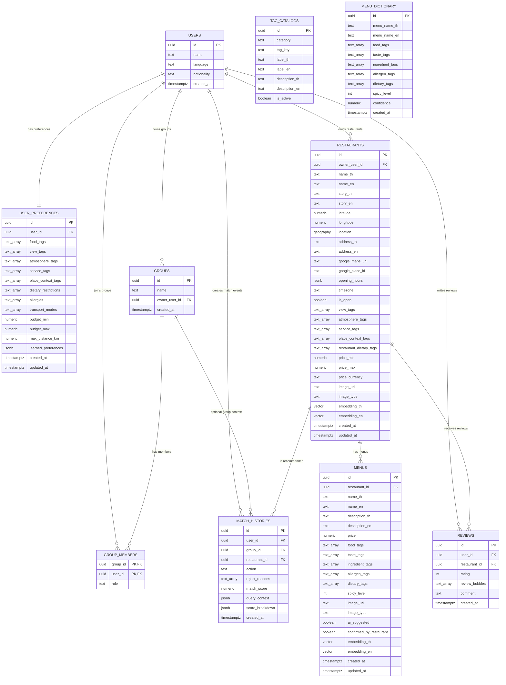

# ER Diagram

This diagram reflects the Phase 1 PostgreSQL/Supabase schema.

## Notes

- `tag_catalogs` is a controlled tag dictionary. Other tables store tag keys in `text[]` fields.
- `menu_dictionary` is used by the menu tag suggestion service. It does not directly reference `menus`.
- `restaurants.location` is a PostGIS `geography(Point, 4326)` field for distance filtering.
- `restaurants.embedding_th`, `restaurants.embedding_en`, `menus.embedding_th`, and `menus.embedding_en` are `vector(384)`.
- Recommendation should start from `menus`, then group safe matching menus back into `restaurants`.
